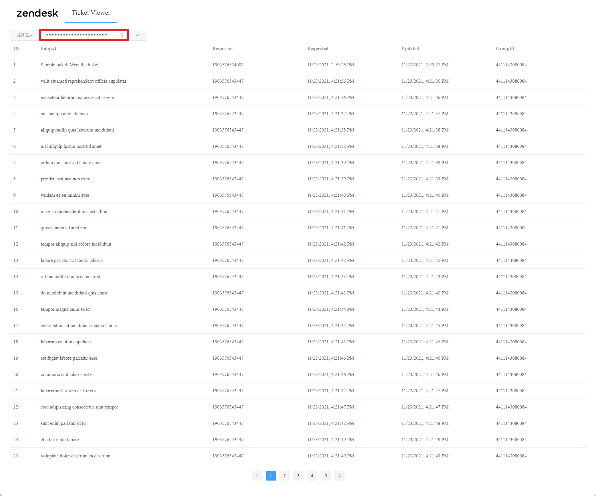

# Intern Coding Challenge - Zendesk Ticket Viewer

Haomin Qiu | haominqiu@gmail.com

## Installation

### Prerequisite

1. **Java 8** environment
   1. problems will occur using java 17
2. Web connection
   1. the project will access `unpkg.com` instead of using `npm`
3. My **API key**
   1. `JG***5z8`, the whole API ley will be attached to the submission email for security reasons.
4. Localhost port 8080 not occupied

### Simply from Jar (Suggested)

1. Download `viewer-1.0.0.jar` from [GitHub releases](https://github.com/Aquafits/zendesk_ticket_viewer/releases).

### Build from source code

1. `./gradlew build`
   1. if you encountered problems like `/bin/sh^M : bad interpreter`, open your script with vi or vim and enter in vi command mode (key Esc), then type this: `:set fileformat=unix`. Finally save it `:x!` or `:wq!`
2. find `viewer-1.0.0.jar` under `./build/libs`

## Usage

1. Start the project

   ```bash
   java -jar viewer-1.0.0.jar
   ```

   

2. Open `localhost:8080` in browser

3. Enter provided **API key** in the slot and click the tick button to view the tickets

   

4. Click on a row to see the ticket details (click back to return to the ticket list)

   

